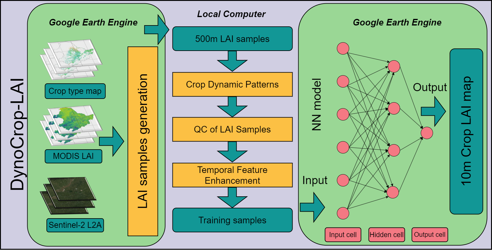
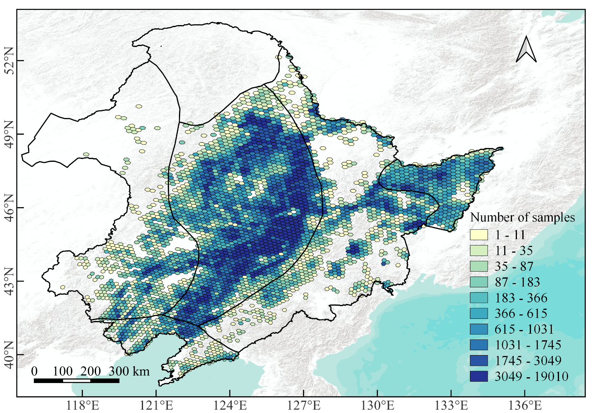
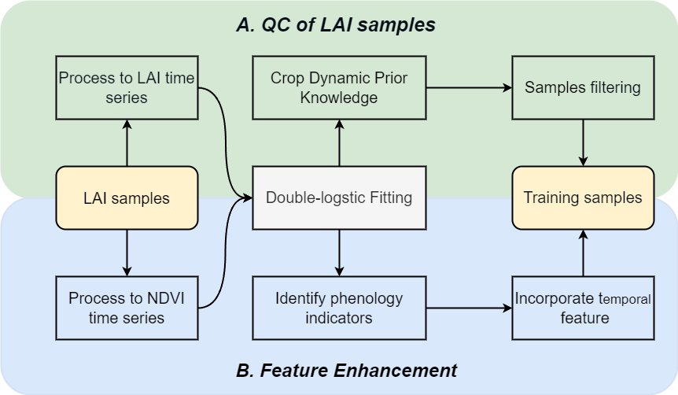
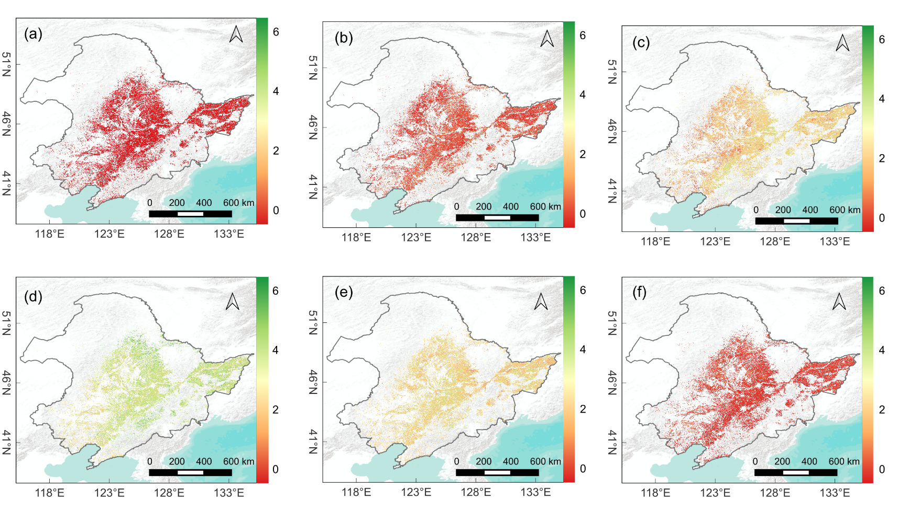
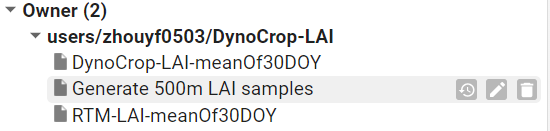

# DynoCrop-LAI

The Google Earth Engine implementation of the DynoCrop-LAI algorithm to estimate Leaf Area Index(LAI).

## A Novel Framework for decametric resolution Crop LAI Mapping Using MODIS LAI and Crop Dynamic Prior Knowledge

This study innovatively developed a 10-meter resolution crop Leaf Area Index (LAI) inversion framework for the Northeast China region, named DynoCrop-LAI. This framework is based on MODIS LAI and Sentinel-2 multispectral data, generating LAI samples on the Google Earth Engine platform, and enhances sample quality and features based on dynamic prior knowledge of crops. Initially, approximately 5.2 million spatially homogeneous crop LAI samples were generated using MODIS LAI and Sentinel-2 surface reflectance data from 2019 to 2021. Subsequently, the core of the DynoCrop-LAI framework includes two key steps: first, sample quality control, employing the Double-Logistic model to construct accurate crop growth models and extracting the dynamic prior knowledge of crops as a benchmark for sample quality control within the framework; second, feature enhancement, extracting temporal features from phenological information to enhance the model's ability to parse vegetation dynamic changes, thus improving the accuracy of LAI inversion. Finally, the study trained a neural network model for estimate crop LAI in the Northeast China using samples after quality control and feature enhancement, and deployed it on the Google Earth Engine platform, generating monthly synthesized LAI distribution maps from 2019 to 2023.

Fig.1. DynoCrop-LAI processing chain. Initially, approximately 5.2 million spatially homogeneous crop LAI samples were produced using MODIS LAI and Sentinel-2 surface reflectance data from 2019 to 2021.Based LAI samples, the study trained a neural network model using samples after quality control and feature enhancement to map crop LAI.

Fig.2. Spatial distribution of samples for intercomparison between Sentinel-2 and MODIS. The color of hexagon grids represents the number of samples within the area.

Fig.3. Flow chart of sample QC and feature 

Fig.4.  Spatial Distribution Maps of Mean Composite DynoCrop-LAI. (a) DOY 110-140, representing the sowing period; (b) DOY 140-170, capturing early growth stages; (c) DOY 170-200, representing the onset of peak vegetation; (d) DOY 200-230, corresponding to the peak growth period; (e) DOY 230-260, indicating the beginning of senescence; (f) DOY 260-290, depicting the late senescence stage and preparation for harvest.

To add the GEE repository containing the DynoCrop-LAI source code to your GEE account click the link below:
https://code.earthengine.google.com/?accept_repo=users/zhouyf0503/DynoCrop-LAI

DynoCrop-LAI-meanOf30DOY : 30-day Mean LAI generated based on the DynoCrop-LAI algorithm

RTM-LAI-meanOf30DOY : 30-day Mean LAI generated based on the RTM algorithm

Generate 500m LAI samples : Source code for efficiently generating 500m LAI samples

## Relevant data

500m LAI samples : [samples](./data)

shpfile : [zone](./data/shpfile)

This repository contains source code associated with our research paper currently under peer review. The provided code is intended solely for the purpose of facilitating peer review and evaluation. We kindly request that users do not cite or distribute this code until the associated research paper has been published.

If you have any further questions or doubts, please don't hesitate to contact us.
